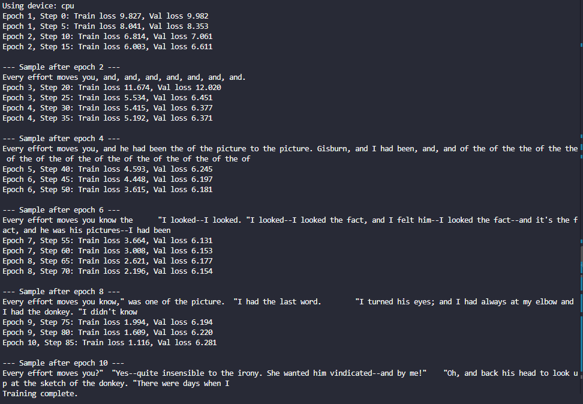
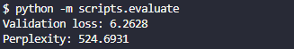
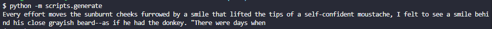

# LLM from Scratch

A learning-focused PyTorch project for understanding how a small GPT-style language model is assembled and trained. The repository combines a compact implementation in `src/` with chapter notebooks and scripts that follow the progression from text data and attention to pretraining and fine-tuning.

This is an educational codebase, not a production LLM framework. The root scripts train a small GPT-style model on *The Verdict*; the chapter materials explore additional concepts and workflows.

## Overview

The reusable implementation tokenizes text with the GPT-2 byte-pair encoding, creates next-token training examples, and feeds them to a decoder-only Transformer. Training minimizes next-token cross-entropy. Separate scripts generate text from a saved checkpoint and report validation loss and perplexity.

The `learning/` directory contains hands-on notebooks and supporting code, including introductory PyTorch materials and examples of classification and instruction fine-tuning. These chapter exercises are distinct from the root scripts.

## Project Visuals



*Pretraining progress and a sample generated by the model.*



*Evaluation output for the trained model.*



*Text generated from a prompt.*

## Why This Project Is Useful

- Follow the model-building process from token IDs and sliding-window batches to attention, Transformer blocks, and text generation.
- Connect the equations and concepts in the book to readable PyTorch modules.
- Experiment with pretraining and notebook-based fine-tuning on small learning datasets.

## Implemented Components

- **Tokenization:** `GPT2Tokenizer` wraps the GPT-2 encoding from `tiktoken`.
- **Dataset preparation:** overlapping input/target token windows and PyTorch `DataLoader` creation.
- **GPT model:** learned token and position embeddings, causal multi-head self-attention, feed-forward layers, residual connections, layer normalization, and vocabulary logits.
- **Training:** next-token cross-entropy, optimizer-driven training, periodic train/validation loss reporting, and sample generation.
- **Evaluation:** loss calculation and perplexity derived from loss.
- **Text generation:** autoregressive greedy decoding, conditioned on the most recent context window.
- **Utilities:** deterministic seed setup and automatic CUDA, Apple MPS, or CPU device selection.
- **Learning notebooks:** text processing, attention, GPT implementation, pretraining, classification fine-tuning, instruction fine-tuning, and PyTorch fundamentals.

## Project Structure

```text
configs/                 Example GPT-2-sized model and training settings
data/raw/                The Verdict training text
checkpoints/             Saved model state dictionary
learning/
  01_working_on_text_data/                  Tokenization and data preparation
  02-coding_attention_mechanisms/           Self-attention exercises
  03-Implementing_a_GPT_model_from_scratch/  GPT architecture notebook
  04_pretrained_on_unlabeled_data/          Pretraining and evaluation materials
  05_finetuning_for_classification/         Classification fine-tuning
  06_fine_tuning_to_follow_instruction/     Instruction fine-tuning
  PyTorch/                                  PyTorch fundamentals
scripts/                 Pretraining, generation, and evaluation entry points
src/                     Reusable model, data, training, and generation code
tests/                   Test directory (currently empty)
assets/                  Example training, evaluation, and generation figures
```

## Requirements

Python 3.10 or newer and the packages in [`requirements.txt`](requirements.txt). The core scripts use PyTorch and `tiktoken`; installing the full requirements also supports the notebooks, including JupyterLab and chapter-specific libraries such as TensorFlow, Matplotlib, pandas, and tqdm.

## Installation and Setup

From the repository root, create and activate a virtual environment, then install the declared dependencies:

```bash
python -m venv .venv
```

Windows PowerShell:

```powershell
.venv\Scripts\Activate.ps1
```

macOS or Linux:

```bash
source .venv/bin/activate
```

Install dependencies:

```bash
python -m pip install --upgrade pip
python -m pip install -r requirements.txt
```

To work through the notebooks, start JupyterLab from the repository root:

```bash
jupyter lab
```

## Usage

Run these module commands from the repository root. Pretraining reads `data/raw/the-verdict.txt`, uses a 90/10 character-based train/validation split, and saves the model weights to `checkpoints/gpt_model.pth`.

```bash
python -m scripts.pretrain
```

The script uses the GPT-2 vocabulary size (50,257), a 256-token context, 768-dimensional embeddings, 12 attention heads, and 12 Transformer layers. Its training settings are currently specified in the script; `configs/gpt2_124m.yaml` is an example configuration and is not loaded by the scripts.

After training, generate from the script's built-in prompt:

```bash
python -m scripts.generate
```

Evaluate the saved checkpoint on the held-out text:

```bash
python -m scripts.evaluate
```

The generation script uses greedy decoding and generates 50 tokens. The evaluation script prints validation loss and perplexity. No benchmark result is claimed here; outputs depend on the training run and environment.

## Model Architecture

`GPTModel` is a decoder-only Transformer. It adds learned token and position embeddings, then applies 12 pre-normalized Transformer blocks. Each block has masked multi-head self-attention and a two-layer feed-forward network with GELU, each with a residual connection. A final layer normalization and bias-free linear head produce next-token logits. Dropout is applied to embeddings, attention weights, and residual paths.

The root scripts configure a 50,257-token vocabulary, 256-token context, 768 embedding dimensions, 12 heads, and 12 layers. The configuration class supports other sizes for experiments.

## Training and Evaluation

The root pretraining script uses AdamW with a learning rate of `4e-4` and weight decay of `0.1`, trains for 10 epochs, and periodically reports train and validation loss. It saves the model `state_dict` after training; optimizer state and training progress are not saved. Training can be computationally demanding, especially on CPU.

Evaluation uses the final 10% of the text as validation data and reports cross-entropy loss and its exponentiated value (perplexity). The repository does not publish fixed scores or claim that this small-corpus model is suitable for general-purpose use.

## Learning Resources and References

The primary learning resource is Sebastian Raschka, [*Build a Large Language Model (From Scratch)*](https://www.manning.com/books/build-a-large-language-model-from-scratch). The `learning/` notebooks follow its progression and adapt selected examples.

- Vaswani et al., [“Attention Is All You Need”](https://arxiv.org/abs/1706.03762) (2017).
- Radford et al., [“Improving Language Understanding by Generative Pre-Training”](https://cdn.openai.com/research-covers/language-unsupervised/language_understanding_paper.pdf) (2018).
- Radford et al., [“Language Models are Unsupervised Multitask Learners”](https://cdn.openai.com/better-language-models/language_models_are_unsupervised_multitask_learners.pdf) (2019).
- Brown et al., [“Language Models are Few-Shot Learners”](https://arxiv.org/abs/2005.14165) (2020).
- Devlin et al., [“BERT: Pre-training of Deep Bidirectional Transformers for Language Understanding”](https://arxiv.org/abs/1810.04805) (2019; a useful comparison with the decoder-only GPT objective).

## Documentation and Support

The primary documentation is in the notebooks under [`learning/`](learning/). For the compact implementation, start with [`src/config.py`](src/config.py), [`src/model.py`](src/model.py), and [`src/training.py`](src/training.py). For questions about the book's original examples, see the [upstream companion repository](https://github.com/rasbt/LLMs-from-scratch).

## Contributing

Small, focused improvements to explanations, examples, and learning exercises are welcome. Please keep changes aligned with the educational scope, describe the learning or behavior change, and include a focused verification where practical. There is no automated test suite in the current `tests/` directory.

## Maintainer

Md Raisul Islam Rimon

## License

This repository is licensed under the [MIT License](LICENSE).